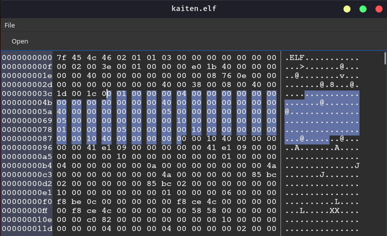

QHexView-ng
==========

This is Qt widget for display binary data in traditional hex-editor style. This widget doesn`t have any editing capabilities. Only viewing and copying.

GUI
-----

Building the example
-----

* cd  QHexView-ng
* mkdir build
* cd build
* cmake ..
* make

Usage
-----
	...
	QHexView *qHexView = new QHexView;
	...
	qHexView->loadFile("to/path/file");
	...
